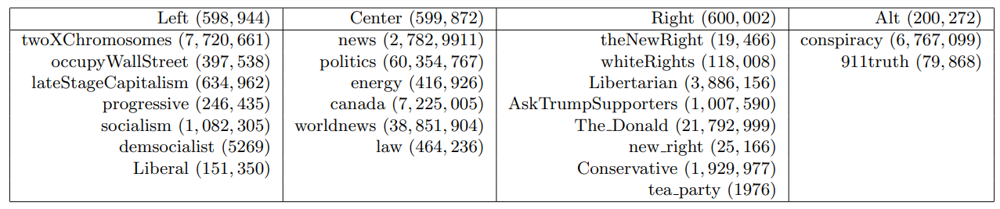

# Reddit Politics Sentiment Analysis

This project conducts sentiment analysis to classify a Reddit comment's political affiliation, ranging from Left, Center, Right and Alt. The data is scrapped with [Pushshift API](https://github.com/pushshift/api). There're 2 millions comments collected. The table below is the count of each data file, and the sources of comments:

**Approach of the Analysis:**

- Preprocessing data

  - Clean text (drop NA, special characters, URLs, HTML tags, duplicated spaces)
  - Lemmatization, Tagging & Sentence segmentation
  
- Feature Engineering

  - Create features from parts of speech, affective ratings, imagery and age-of-acquisition scores

- Train-validate-test multiple classifiers and tune the best model's hyperparameter:

  - SGD (0.3849)
  - GaussianNB (0.3476)
  - Random Forest (0.4318)
  - AdaBoost (0.4427)
  - **MLP (0.4473)** 

  

**Live View of the analysis:** https://georgehua.github.io/reddit-politics-sentiment-analysis/